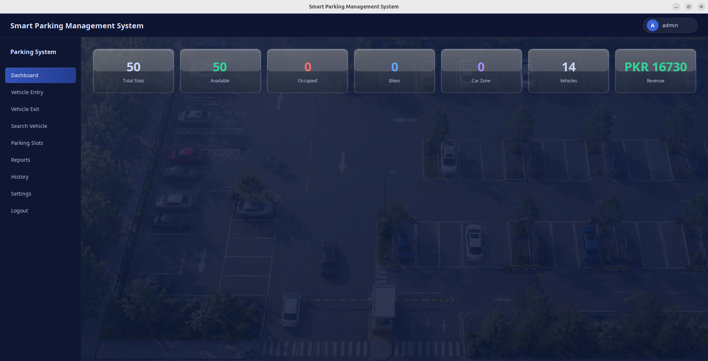
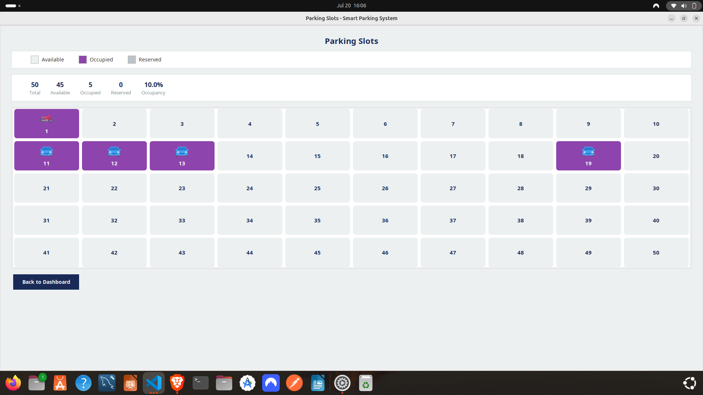
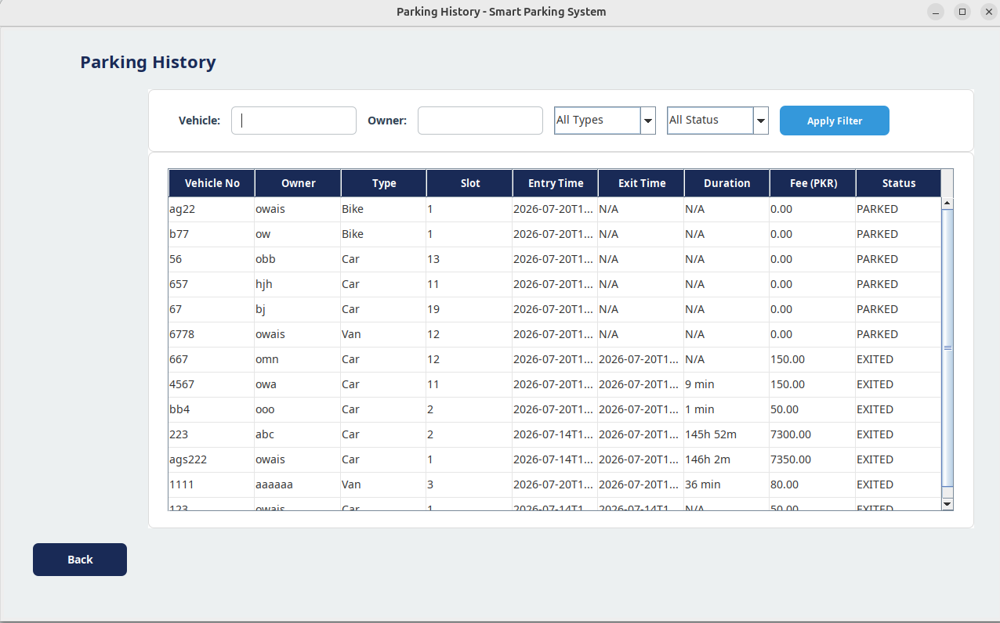
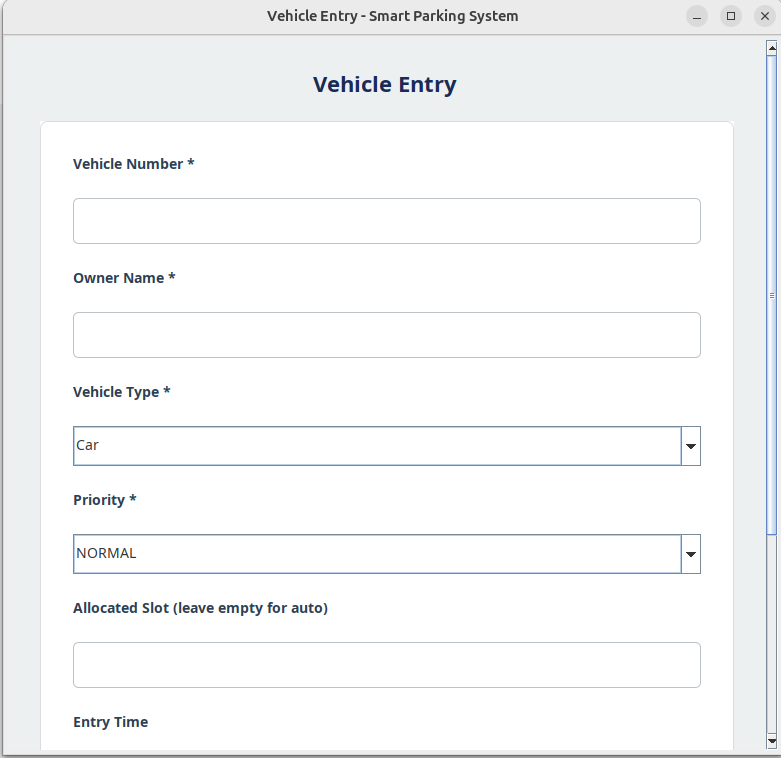

# Smart Parking Management System

Java Swing + SQLite desktop app for managing vehicle parking with multiple built-in data structures and algorithms.

## Features

- Admin login with hashed passwords
- Vehicle entry/exit with priority support
- Smart slot allocation and live parking-slot view
- Parking fee calculation and reports export
- Vehicle history and search
- DSA-backed modules: AVL tree, BST, linked lists, hash table, trie, stack, queue, min heap, sorting, graph, greedy slot allocator

## Pictures 
 , 
 , 


## Tech

- Java Swing UI
- SQLite (`parking.db`)
- External libs in `lib/`: `sqlite-jdbc.jar`, `slf4j-api-2.0.9.jar`, `slf4j-simple-2.0.9.jar`

## Getting Started

```bash
javac -cp "lib/*" -d out src/project_of/_dsa/*.java
java -cp "out:lib/*" project_of._dsa.Project_of_DSA
```

## Default Login

- Username: `admin`
- Password: `admin`

## Notes

- `PROJECT_DOCUMENTATION.md` contains the full architecture, data structures, and file-level documentation.
- Generated build artifacts are tracked in `out/`.
